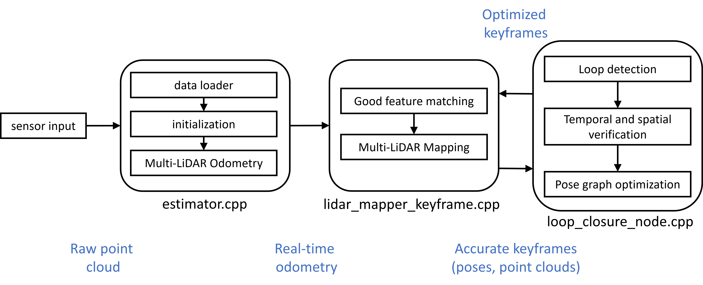

# M-LOAM
### Multi-LiDAR Odometry and Mapping
M-LOAM is a robust system for multi-LiDAR extrinsic calibration, real-time odometry, and mapping. Without manual intervention, our
system can start with several extrinsic-uncalibrated LiDARs, automatically calibrate their extrinsics, and provide accurate poses as well as a globally consistent map.

**Authors:** 
[Jianhao Jiao](http://gogojjh.github.io), 
[Haoyang Ye](https://github.com/hyye),
[Yilong Zhu](https://scholar.google.com/citations?user=x8n6v2oAAAAJ&hl=zh-CN),
[Linxin Jiang](),
[Ming Liu](https://scholar.google.com/citations?user=CdV5LfQAAAAJ&hl=zh-CN)
from [RAM-LAB](https://www.ramlab.com), [HKUST](http://www.ust.hk/)

**Project website:** https://ram-lab.com/file/site/m-loam

### 1. Prerequisites
#### 1.1 **Ubuntu** and **ROS**
Ubuntu 64-bit 16.04 or 18.04.
ROS Kinetic or Melodic. [ROS Installation](http://wiki.ros.org/ROS/Installation)

#### 1.2. **Ceres Solver**
Follow [Ceres Installation](http://ceres-solver.org/installation.html).

#### 1.3. **PCL**
Follow [PCL Installation](http://www.pointclouds.org/downloads/linux.html).
> NOTE: <br>
> Starting with PCL-1.7 you need to define PCL_NO_PRECOMPILE before you include any PCL headers to include the templated algorithms as well.
> Choose the right linear solver: http://ceres-solver.org/solving_faqs.html

#### 1.4. **OpenMP**
```sudo apt install libomp-dev```
> NOTE: <br>
> tutorial: https://bisqwit.iki.fi/story/howto/openmp/#IntroductionToOpenmpInC <br>
> slide: https://www3.nd.edu/~zxu2/acms60212-40212-S12/Lec-11-01.pdf

#### 1.5. **Eigen3**
```sudo apt install libeigen-dev```
> NOTE: to prevent Eigen error: <br> 
> https://eigen.tuxfamily.org/dox/group__TopicUnalignedArrayAssert.html

#### 1.6. **GLOG, GFLAGS, GTEST**
> NOTE: installation <br>
> https://juejin.im/post/5dca40b9f265da4d226e397e

### 2. Build M-LOAM
```catkin build mloam```

### 3. Example
* Datasets collected with different platforms:
  1. [Simulation Robot (SR)](http://gofile.me/4jm56/k8xoztYes)
  2. [Real Handheld Device (RHD)](http://gofile.me/4jm56/2t7jU8PJ5)
  3. [Real Vechile (RV)](http://gofile.me/4jm56/ZcX6m8vZV)
  4. [Oxford RoboCar](http://gofile.me/4jm56/i2oWOo9Gy)

* Run M-LOAM and baseline methods
  1. We provide a script to perform batch testing of M-LOAM with baseline methods
  2. Enter the script folder: ``roscd mloam/script/``
  3. Modify the python script: ``run_mloam.py`` for specific platforms with correct path
  4. Modify the shell files for methods in ``xx_main.sh``
  5. Run the python script: ``python2 run_mloam.py -program=single_test -sequence=xx -start_idx=0 -end_idx=0``

### 5. Results
<!-- **red**: odometry; **green**: mapping; **blue**: gt -->
<!-- <a href="https://www.youtube.com/embed/WDpH80nfZes" target="_blank"></a> -->

* Test with SR <br>


* Test in HKUST with RHD <br>


* Test with RV <br>


* Test with Oxford RoboCar <br>


### 6. Additional Features (have not fixed)
* Future research
  1. Add a loop closure
  2. Object-centric SLAM
  3. Use more representative features
  4. Integrated with high-frequency sensors
  5. cross-domain, cross-modal dataset (simulator) for autonomous driving

### 6. System pipeline
* Pipeline <br>


### 7. Acknowledgements
Thanks for these great works from which we learned to write M-LOAM

* LOAM (J. Zhang and S. Singh. LOAM: Lidar Odometry and Mapping in Real-time) and its advanced version: [A-LOAM](https://github.com/HKUST-Aerial-Robotics/A-LOAM);
* [LEGO-LOAM](https://github.com/RobustFieldAutonomyLab/LeGO-LOAM)
* [LIO-MAPPING](https://github.com/hyye/lio-mapping)
* [VINS-MONO](https://github.com/HKUST-Aerial-Robotics/VINS-Mono)

### 8. Licence
The source code is released under GPLv3 license.

We are still working on improving the code reliability. For any technical issues, please contact Jianhao JIAO \<jjiao@ust.hk>, Haoyang Ye \<hyeab@ust.hk>, and Yilong Zhu \<yzhubr@ust.hk>

For commercial inquiries, please contact Prof.Ming Liu \<eelium@ust.hk>

<!-- ### 8. Compared with LEGO-LOAM
* Note: 0.2/0.4 (corner/surf resolution)
Algorithm                  | LEGO-LOAM  | M-LOAM 
---------------            | ----       | ---  
before ds                  | 18734/90578| 59494/78022
after ds                   | 11934/28110| 27954/14719
ds map time                | 6.63ms     | 12.08ms
input surf/corner num      | 3387/736   | 3785/2244
ds current scan time       | 0.5851ms   | 2.37ms
matching feature time      | 8.67ms     | 14.52ms
whole optimization time    | 60-100ms   | 100-200ms
save keyframes time        | 0.3913ms   | 0.000172ms
 -->
